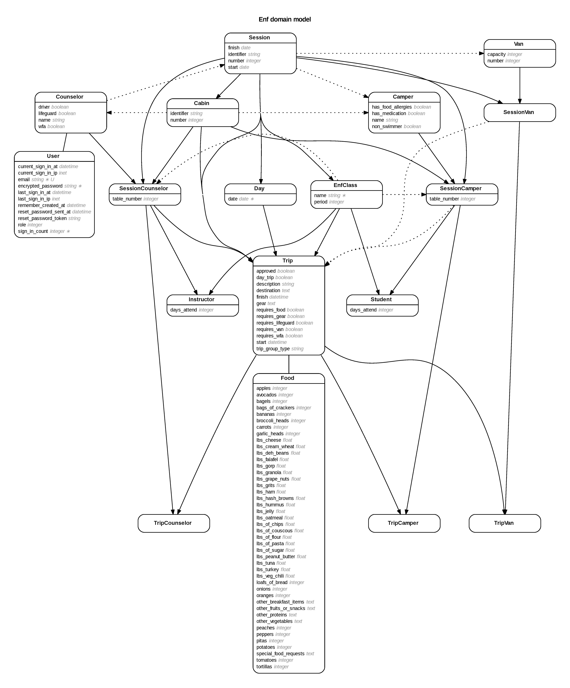

# ENF Portal

[Deployed Application](https://radiant-plateau-85733.herokuapp.com) ( you can sign in with the username bsutt123@gmail.com and password to get admin access)

This Ruby on Rails application was designed to help a Summer Camp manage their camps activites online. As such, a lot of the decisions were specific to the way that this camp runs in particular and should not be applied to a general application.

## Intention
There is a massive amount of structuring and planning that has to occur at any summer camp. There are lots different classes all with different students throughout the day, and there has to be a flexible system to know where students are at all times for safety concerns. Currently, the summer camp I attended uses 3-4 adminstrators whose main job is to simply track and plan classes and trips and make sure that they have the resources that they need to have a successful outing. Currently, much of this jobs role is to manually check for complications that will negatively affect the trip (like there isn't a van that can fit all the students, not enough counselors on campus to maintain ratios, etc...). It was my intention to give these adminstrators better tools to track students, classes, trips, and everything on campus such that they could have more time to do what is most important, which is interact and teach the campers new and fun skills. It does this by making counselors fill out Trip Requests online through the portal, and then the adminstrators can use the tools to quickly assess problems and approve or deny the trip.

## Key Model Definitions

If you want to try and understand the code and whats its doing, the basis starts with the models and what they represent. There are enough models and they are interconnected enough that I'm going to go over the broad structure of what each model does.

Small note on a convention I followed for join tables. Often, a particular model might have information that persists year to year and information that is important only within the context of a particular session. When you see a combination like SessionCamper, it means that it is all the Campers information which is important for that particular Session, such as Cabin, Classes, etc... This convention is followed heavily throughout the code and is needed to really understand how everything is connected

* Session: A Session is a set of days, and almost all models have an existence within the context of a particular session
* Counselor: An adult who teaches classes and has a cabin
* Camper: a child who attends classes and has a cabin
* Cabin: Cabins are a collection of SessionCampers and SessionCounselors (because the Cabin only exists within the context of a Session)
* Classes: Classes are also a collection of SessionCampers (students) and SessionsCounselors (instructors)
* Trips: Trips are off campus outings which are take by a Class or a Cabin
* Vans: Vans are assigned to Trips to allow them to go off campus and can't overlap with other trips

Obivously, this is a very broad definition of each model, and you can get a feel for the complexity from this graph of the database connections...

## Using the Application

To use the application, the administrators have to add you as a User, which will restrict access to the information to only authorized individuals. If you want to visit the test site, then you can use

* username: bsutt123@gmail.com
* password: password

Obviously, this test site doesn't contain any sensitive information about real people, but it does display the functionality of the portal.

Admins will see two nav bars...

The top nav in green is accessible to all Users (so regular and admin users) and the bottom grey bar is only accessible to admin users.

For regular users, the biggest thing that they will do is to submit trip requests online. This is the role that they play in the system, basically letting the admins knows that they would like to go off campus, and then the admins are able to use their more powerful tools to access whether or not that will be possible.

Visiting the Trips page for a particular sessions will display broad amounts of information about all Trips for that session.